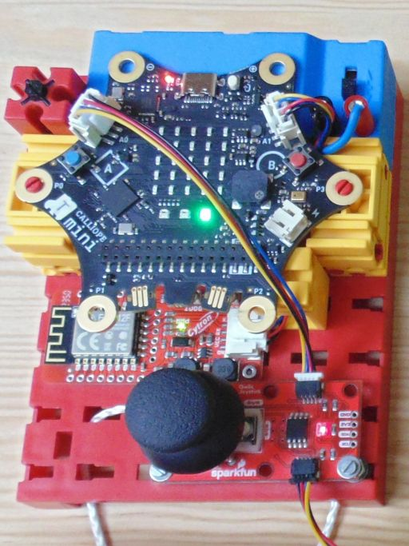
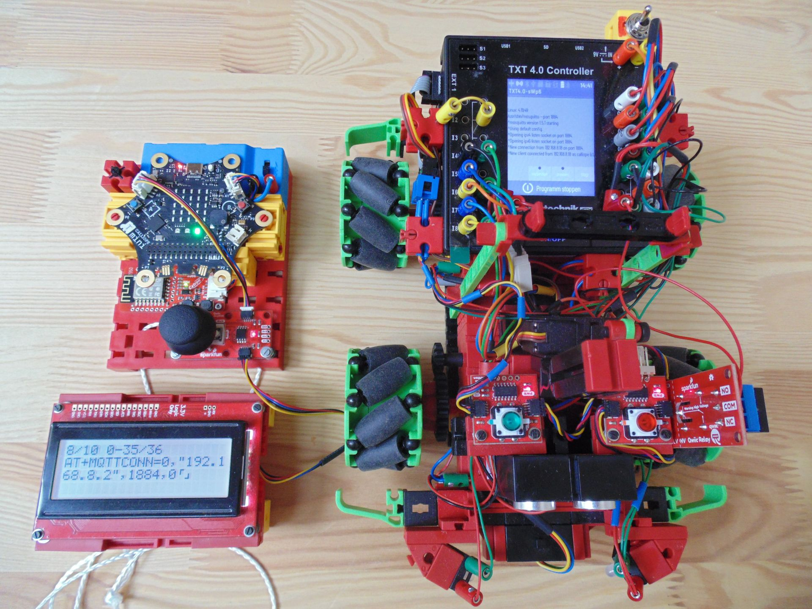

Diese Seite bei [https://elssner.github.io/MQTT-Fernbedienung/](https://elssner.github.io/MQTT-Fernbedienung/) öffnen

## Calliope WLAN Fernbedienung (MQTT / IoT)

* WLAN Modul: [Cytron: Grove WiFi 8266 - IoT for micro:bit and beyond](doc/)
* Calliope v3 Projekt laden: [elssner/MQTT-Fernbedienung](https://elssner.github.io/MQTT-Fernbedienung/)

#### LED Farben
* `weiß` am Anfang eines Ereignisses (zeigt, dass Taste gedrückt wurde)
* `grün` bei OK nach einem AT-Kommando
* `rot` bei Fehler nach einem AT-Kommando
* `orange` Warnung
* `blau` Verbindung ist aktiv
* `gelb` Verbindung getrennt (mit Knopf B)

### `a` beim Start
* `a weiß` serielle Schnittstelle wird initialisiert
* `a gelb` 2 Sekunden warten auf Stromversorgung
* LCD Display erkennen und initialisieren
* `b orange` wenn kein Display erkannt
* AT+RST (Reset WLAN Modul)
* `a grün` bei Erfolg `a rot` bei Fehler
* Anzeige der AT Response auf LCD Display

Jetzt sollte `a grün` leuchten und - wenn kein Display angeschlossen ist - `b orange`.

### `b` Kopf B geklickt
* MQTT verbinden
  * `b weiß` wenn Kopf B geklickt
  * WLAN verbinden (SSID und Password)
  * `b grün` bei Erfolg `b rot` bei Fehler
* MQTT trennen (wenn verbunden)
  * `a aus` und  `b aus`
  * <ins>MQTT trennen</ins>
  * `c gelb` bei Erfolg `c rot` bei Fehler
* Anzeige der AT Response auf LCD Display

Jetzt sollte beim Verbinden `a grün` und `b grün` leuchten.
Nach dem Trennen nur `c gelb`.

### `c` Kopf B halten
* `c weiß` Kopf B erkannt, loslassen
* MQTT Client vorbereiten (ID, Username, Password)
* `c rot` bei Fehler
  * bei Erfolg
  * MQTT Client verbinden (IP Adresse, Port)
  * `c grün` bei Erfolg, `c orange` bei Fehler
  * <ins>MQTT ist verbunden</ins>
  * `a blau` wenn Gesten aktiviert
  * `b blau` wenn Joystick angeschlossen
* Anzeige der AT Response auf LCD Display

`c grün` zeigt an, dass MQTT verbunden und die Fernbedienung bereit ist.\
`b blinkt blau`, wenn die Daten vom Joystick gesendet werden.\
`a blau`, wenn die Gesten gesendet werden (muss noch aktiviert werden).

> Gesten funktionieren nur, wenn kein LCD Display angeschlossen ist.

### Kopf A geklickt
* wenn Display angeschlossen
  * die letzten 10 Response Strings im Display anzeigen
  * mit jedem Klick auf A wird weiter geschaltet (nur vorwärts)
* wenn <ins>MQTT verbunden</ins> (und kein Display)
  * Gesten abwechselnd an und aus `a aus` schalten
  * `a lila` Geschwindigkeit beim Neigen langsamer
  * `a blau` Geschwindigkeit beim Neigen max (512)

### Kopf A halten
* wenn Display angeschlossen
  * AT+MQTTCONN? MQTT Status abrufen und anzeigen
* wenn kein Display angeschlossen
  * den letzten Response String im Calliope Display anzeigen

### Kopf A+B geklickt
* zur Zeit nicht verwendet

### Gesten (Calliope neigen, kippen, drehen)

* wenn Logo nach unten
* wenn Logo nach oben
* wenn nach links neigen
* wenn nach rechts neigen
* wenn Display nach unten
* wenn Display nach oben

↶| |↷
---|---|---
↖|↑|↗
←|↯|→
↙|↓|↘

Modell fährt in die entsprechende Richtung. Die Tabelle zeigt alle möglichen Richtungen (8 gerade, 2 auf der Stelle drehen und Stop).
Dabei werden teilweise zwei aufeinander folgende Gesten ausgewertet (erst links/rechts neigen, dann vor/zurück oder nach unten drehen).

